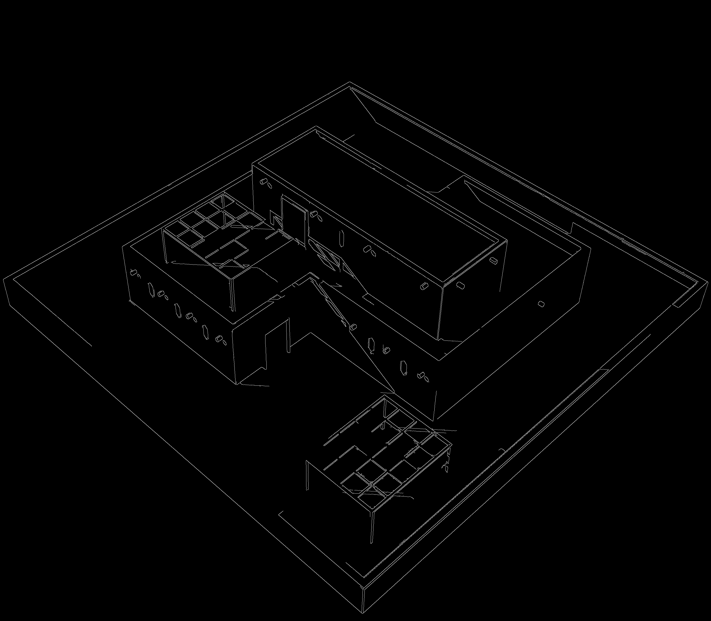
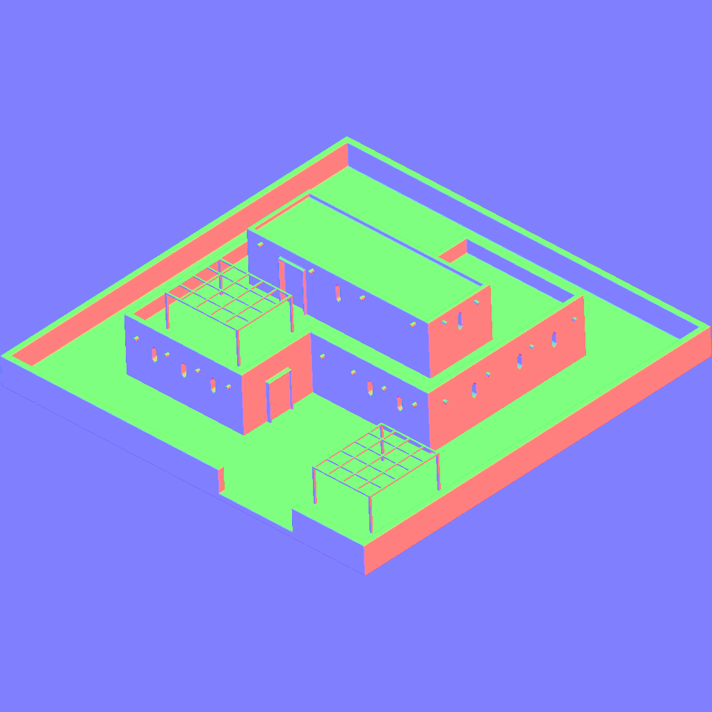

# Sketch2CAD framework

A collection of tools for converting images to CAD-compatible formats and generating normal maps.

## Tools

### Image to Hand-drawn sketch

Converts photos into hand-drawn sketch style images with algebraically formalised lines (y = kx + b)

<div align="center">



</div>
#### Features

- Edge detection using Canny algorithm
- Line extraction and vectorization
- Support lines generation for artistic effect
- Configurable parameters for fine-tuning the output

#### Usage

```bash
./img2sketch <input_image> <output_image> [strength] [merge_angle] [merge_dist] [jitter]
```

Parameters: https://mail.yandex.ru/?uid=2045477413#tabs/relevant

- `input_image`: Path to input image
- `output_image`: Path to save output image
- `strength`: Gradient scaling for normal map (default: 10.0)
- `merge_angle`: Max angle between lines to merge in degrees (default: 60.0)
- `merge_dist`: Max endpoint distance to merge lines in pixels (default: 15.0)
- `jitter`: Stroke jitter amplitude (default: 0.0)

#### Output

The program generates two files:

- `{output_image}_edges.png`: The edge detection result
- `{output_image}_lines.png`: The final sketch with support lines

#### Dependencies

- OpenCV 4.x with ximgproc module
- C++17 or later compiler

#### Build

```bash
g++ -std=c++17 -O3 -Wall -Wextra -march=native img2sketch.cpp -o img2sketch `pkg-config --cflags --libs opencv4`
```

### Object to Normal Map

Generates a tangent-space normal map from a Wavefront .obj model.

#### Example

<div align="center">


</div>

#### Features

- OBJ model support
- Configurable projection direction and in-plane rotation
- Customizable output resolution
- Projection plane translation

#### Usage

```bash
./obj2normalmap --obj <file> [options]
```

Options:

- `--obj <file>`: OBJ file path (required)
- `--dir <x> <y> <z> [w]`: Projection direction D and optional in-plane rotation w in radians
- `--size <width> <height>`: Output resolution (default: 1024 × 1024)
- `--offset <u> <v>`: Translate projection plane (world units)
- `--index <n>`: Suffix integer for output file name

#### In-plane Rotation

The direction vector `dir = (x, y, z, w)` is used as follows:

- D = normalize(x, y, z) → projection vector
- Basis (U0, V0) is built orthogonal to D
- Apply 2-D rotation of w radians around D:
  - U = U0·cos − V0·sin
  - V = U0·sin + V0·cos

#### Dependencies

- tiny_obj_loader.h (https://github.com/tinyobjloader/tinyobjloader)
- stb_image_write.h (https://github.com/nothings/stb)

#### Build

```bash
g++ -std=c++17 -O2 obj2normalmap.cpp -o obj2normalmap
```

## Author

Dmitry T
