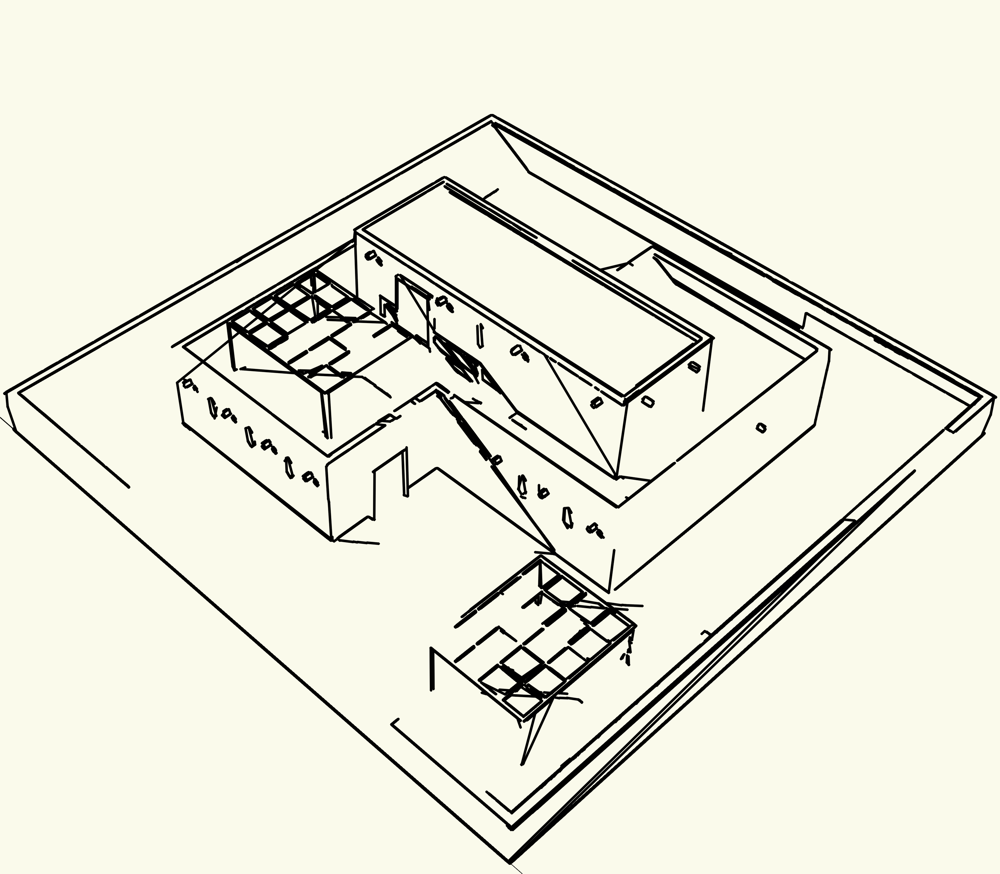
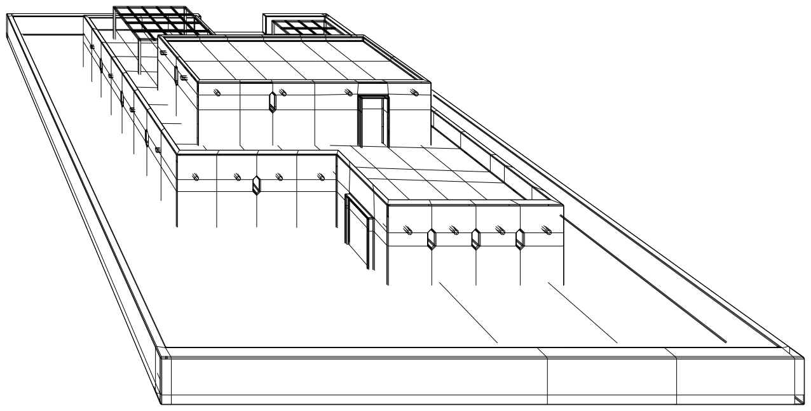

# ✨ Sketch2CAD

*A tiny C++ toolbox that turns raw meshes or images into CAD‑ready assets: normal‑maps, vector edges and hand‑drawn rough sketches.*

<p align="center">
  
  
  
</p>

<br/>

| Converter         | From → To                                       | Highlights                                                        |
| ----------------- | ----------------------------------------------- | ----------------------------------------------------------------- |
| **Obj2NMap**      | `*.obj` → tangent‑space **normal‑map** (`.png`) | isotropic projection, look‑at camera, in‑plane rotation           |
| **VisibleEdges**  | `*.obj` → **SVG** of only *visible* edges       | Painter’s algorithm + Clipper2 boolean, perfect for laser cutters |
| **Svg2RoughJS**   | plain **SVG** → hand‑drawn **rough** SVG        | wraps the wonderful [`roughjs`](https://roughjs.com) CLI          |
| **Img2Sketch**    | photo → vector **sketch** PNG                   | Canny + Hough + line‑merging with jitter                          |
| **NMap2Surfaces** | normal‑map → surface txt                        | extracts dominant planes *(experimental)*                         |

---

## 🌱 Quick start

```bash
# clone repo & submodules
$ git clone --recursive https://github.com/yourname/sketch2cad.git
$ cd sketch2cad

# build release
$ make                   # lib + CLI
$ make tests             # optional, needs gtest & opencv

# run the full pipeline on an OBJ
$ bin/converter_cli .examples/house.obj out.svg \
      obj2nmap visible_edges svg2roughjs \
      --cam_x 2 --cam_y 2 --cam_z -10 \
      --roughness 2.5
```

After a few seconds you’ll get:

```text
out_normal_map.png
out_visible_edges.svg
out_rough.svg
```

---

## 📦 Dependencies

| Mandatory              | Version                  | Notes                         |
| ---------------------- | ------------------------ | ----------------------------- |
| **C++17** compiler     | ≥ g++‑10 / clang‑12      |                               |
| **Clipper2**           | vendored (git submodule) | boolean ops for visible edges |
| **tinyobjloader**      | header‑only (vendored)   | OBJ parsing                   |
| **stb\_image / write** | header‑only (vendored)   | PNG IO                        |

Optional modules:

* **OpenCV 4** (`opencv4.pc`) — required for *Img2Sketch* and *NMap2Surfaces* tests.
* **GoogleTest** — only for the unit‑test target.
* **Node.js ≥ 18** — runs the RoughJS CLI.

All third‑party headers live in `external/` so the default `make` works offline.

---

## 🔧 Build matrix

```text
make                # release
make DEBUG=1        # debug symbols, -O0 -g
make tests          # compile & run Google tests
make clean          # remove build/ and bin/
```

The Makefile autodetects `opencv4` & `gtest` via `pkg‑config`. If they’re not
present, the corresponding converters/tests are silently skipped.

---

## 💡 Design overview

```
converter_cli
└── Pipeline (linked list)
    ├─ OBJ2NMapConverter      (src/OBJ2NMapConverter.cpp)
    ├─ VisibleEdgesConverter  (…)
    ├─ SVG2RoughJSConverter   (…)
    └─ …                      (easy to extend!)
```

Each converter implements the `IConverter` interface → reusable & testable.
New formats take \~50 LOC to plug in.

---

## ✍️ Examples

<p align="center">
  
  
  
</p>

---

## 🚀 Roadmap

* [ ] **GLTF2 support**
* [ ] Real‑time GUI with ImGui
* [ ] CUDA backend for rasteriser

Pull‑requests & issues welcome!

---

## © 2025 Dmitry Tetkin

Licensed under the MIT License.
