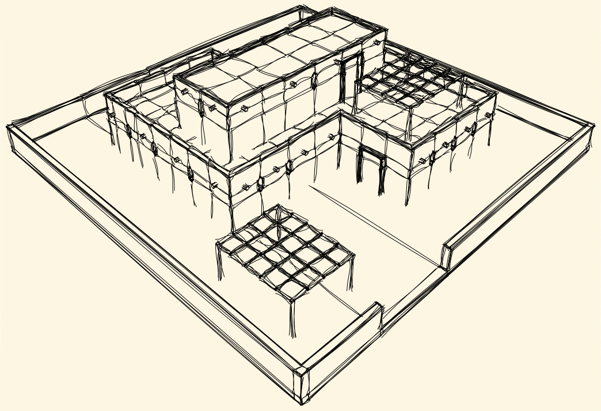
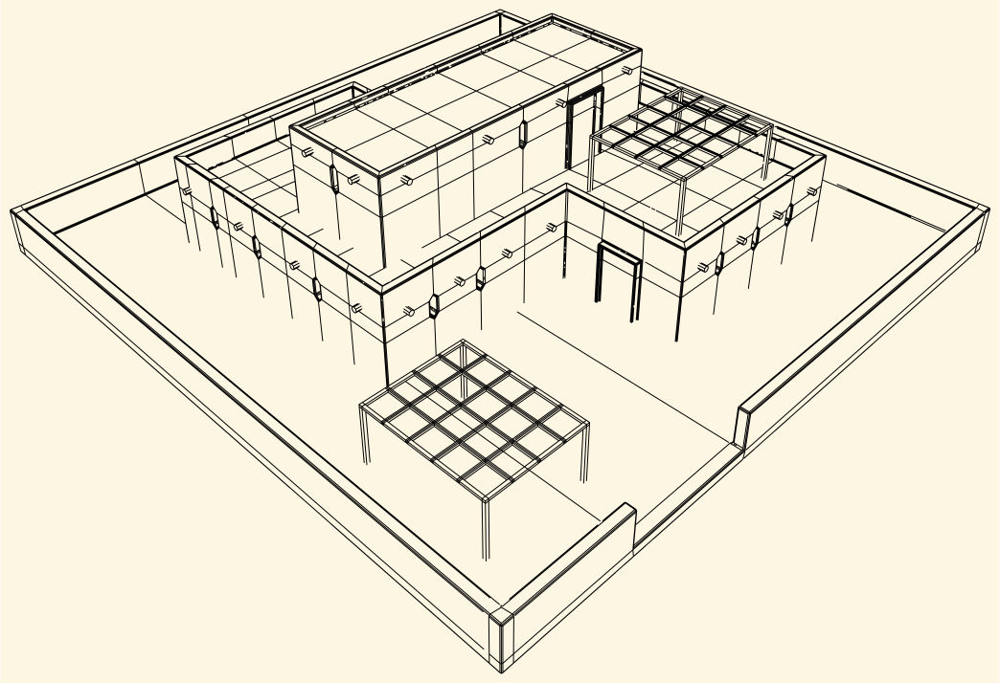
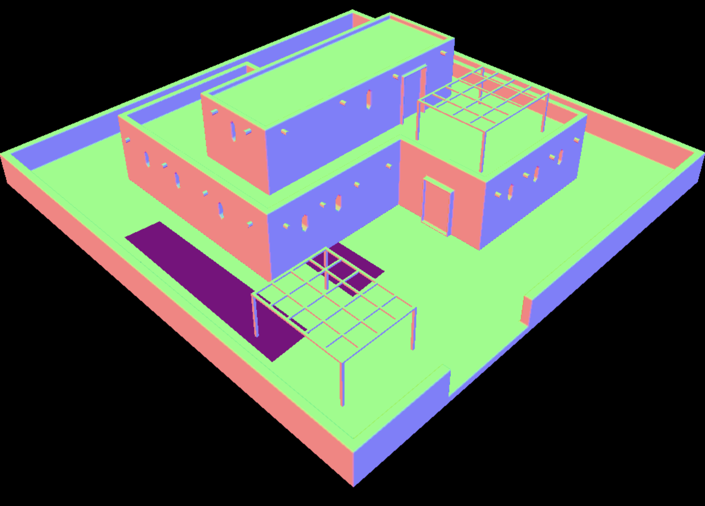
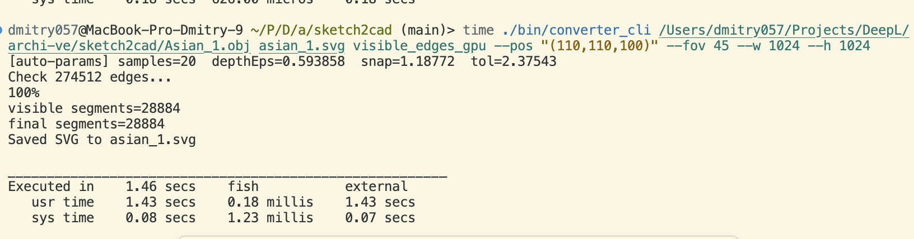
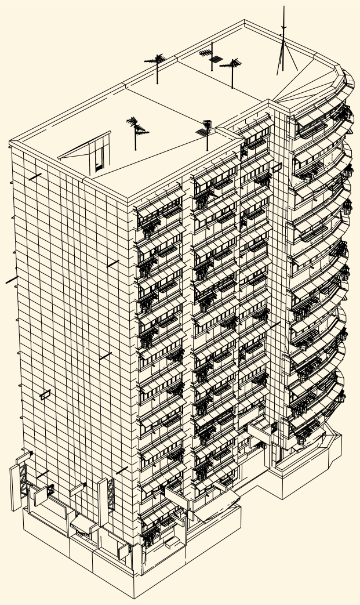

# ✨ Sketch Tool

*A tiny C++ toolbox that turns raw meshes or images into CAD‑ready assets: normal‑maps, vector edges and hand‑drawn rough sketches.*

<p align="center">
  
  
  
</p>

<br/>

| Converter               | From → To                                                   | Highlights                                                               |
| ----------------------- | ------------------------------------------------------------ | ------------------------------------------------------------------------ |
| **Obj2NMap**      | `*.obj` → tangent‑space **normal‑map** (`.png`) | orthographic/perspective projection, look‑at camera, in‑plane rotation |
| **VisibleEdges**  | `*.obj` → **SVG** of only *visible* edges         | Painter’s algorithm + Clipper2 boolean, perfect for laser cutters       |
| **Svg2RoughJS**   | plain**SVG** → hand‑drawn **rough** SVG        | customizable roughness, fill styles, hatching patterns                   |
| **Img2Sketch**    | photo → vector**sketch** PNG                          | Canny + Hough + line‑merging with jitter                                |
| **NMap2Surfaces** | normal‑map → surface txt                                   | extracts dominant planes*(experimental)*                                 |

---

## 🌱 Quick start

```bash
# clone repo & submodules
$ git clone --recursive https://github.com/yourname/sketch2cad.git
$ cd sketch2cad

# build release
$ make                   # lib + CLI
$ make tests             # optional, needs gtest & opencv

# run the full pipeline on an OBJ
$ bin/converter_cli .examples/house.obj out.svg \
      obj2nmap visible_edges svg2roughjs \
      --pos "(2,2,-10)" --focal 1000 \
      --roughness 2.5
```

After a few seconds you’ll get:

```text
out_normal_map.png
out_visible_edges.svg
out_rough.svg
```

---

## 🛠️ Installation

For a complete automated setup, use the installation script:

```bash
# Make the script executable and run it
chmod +x install.sh
./install.sh
```

This script will:

- Check and install system dependencies (OpenCV, Google Test, Clipper2)
- Initialize git submodules
- Install Node.js dependencies for SVG2RoughJS
- Build the project with all components
- Run tests to verify everything works
- Create an environment setup script

**Prerequisites:**

- macOS (with Homebrew) or Ubuntu/Debian (with apt)
- Git
- Make
- C++17 compatible compiler (gcc/g++ or clang)

**Manual installation:** If you prefer to install dependencies manually, see the [Dependencies](#-dependencies) section below.

---

## 📦 Dependencies

| Mandatory                    | Version                  | Notes                         |
| ---------------------------- | ------------------------ | ----------------------------- |
| **C++17** compiler     | ≥ g++‑10 / clang‑12  |                               |
| **Clipper2**           | vendored (git submodule) | boolean ops for visible edges |
| **tinyobjloader**      | header‑only (vendored)  | OBJ parsing                   |
| **stb\_image / write** | header‑only (vendored)  | PNG IO                        |

Optional modules:

* **OpenCV 4** (`opencv4.pc`) — required for *Img2Sketch* and *NMap2Surfaces* tests.
* **GoogleTest** — only for the unit‑test target.
* **Node.js ≥ 18** — runs the RoughJS CLI.

All third‑party headers live in `external/` so the default `make` works offline.

---

## 📋 Parameters

### 3D Converters (obj2nmap, visible_edges)

#### Camera & Projection

- `--pos "(x,y,z)"` - Camera position (default: auto-calculated)
- `--dir "(x,y,z)"` - View direction (default: (0,0,1))
- `--focal <value>` - Focal length for perspective projection (default: 0 = orthographic)
- `--fov <degrees>` - Field of view in degrees (alternative to focal)
- `--rot <degrees>` - In-plane rotation (default: 0)

#### Output Settings

- `--w <width>` - Output width (default: 800)
- `--h <height>` - Output height (default: 800)
- `--samples <value>` - Number of samples for visible_edges (default: auto-optimized)

**Note:** Use `--samples > 200` only when quality improvement justifies longer rendering time. For most cases, keep it under 200 or omit entirely. With auto-optimized samples, the output already has a sketch-like appearance without needing svg2roughjs.

### SVG2RoughJS Converter

#### Roughness & Style

- `--roughness <value>` - Roughness level (0-10, default: 1.0)
- `--bowing <value>` - Bowing factor for lines (default: 0)
- `--fillStyle <style>` - Fill style: "hachure", "solid", "zigzag", "cross-hatch", "dots", "dashed", "zigzag-line" (default: "hachure")
- `--fillWeight <value>` - Fill weight/thickness (default: 0.5)

#### Hatching Options

- `--hachureGap <value>` - Gap between hatching lines (default: 4)
- `--hachureAngle <degrees>` - Angle of hatching lines in degrees (default: -41)

#### Typography

- `--font <family>` - Font family for text elements (default: system font)

### Examples

```bash
# 3D Converters
# Orthographic projection (default)
./bin/converter_cli model.obj output.png obj2nmap

# obj to normal map
./bin/converter_cli tests/part.obj nm.png obj2nmap \
       --pos "(10,10,10)" --fov 10 --w 1024 --h 1024

# obj to edges
./bin/converter_cli tests/part.obj edges.svg visible_edges \  
 --pos "(10,10,10)" --fov 10 --w 1024 --h 1024

# SVG2RoughJS Converter
# Basic rough conversion
./bin/converter_cli input.svg output.svg svg2roughjs --roughness 2.5

# Custom fill style and hatching
./bin/converter_cli input.svg output.svg svg2roughjs --roughness 3 --fillStyle "cross-hatch" --hachureGap 6

# Pipeline: OBJ → edges → rough sketch
./bin/converter_cli model.obj final.svg obj2nmap visible_edges svg2roughjs --focal 1000 --roughness 2.5
```

---

## 🔧 Build matrix

```text
make                # release
make DEBUG=1        # debug symbols, -O0 -g
make tests          # compile & run Google tests
make clean          # remove build/ and bin/
```

The Makefile autodetects `opencv4` & `gtest` via `pkg‑config`. If they’re not
present, the corresponding converters/tests are silently skipped.

---

## 💡 Design overview

```
converter_cli
└── Pipeline (linked list)
    ├─ OBJ2NMapConverter      (src/OBJ2NMapConverter.cpp)
    ├─ OBJ2EdgesConverter  (…)
    ├─ SVG2RoughJSConverter   (…)
    └─ …                      (easy to extend!)
```

Each converter implements the `IConverter` interface → reusable & testable.
New formats take \~50 LOC to plug in.

## ⚡ Performance Showcase

**OBJ2Edges algorithm performance on high-poly models:**

<p align="center">
  
</p>

**Results:**

- **274,512 edges** processed in **1.43 seconds**
- **28,884 visible segments** extracted
- **Automatic parameter optimization** for optimal quality
- **GPU-accelerated ray tracing** with Embree

<p align="center">
  
</p>

*The algorithm automatically adapts parameters based on model complexity, ensuring optimal performance for any mesh size.*

---

## 🚀 Roadmap

* [ ] **GLTF2 support**
* [ ] Real‑time GUI with ImGui
* [ ] CUDA backend for rasteriser

Pull‑requests & issues welcome!

---

## © 2025 Dmitry Tetkin

Licensed under the MIT License.
